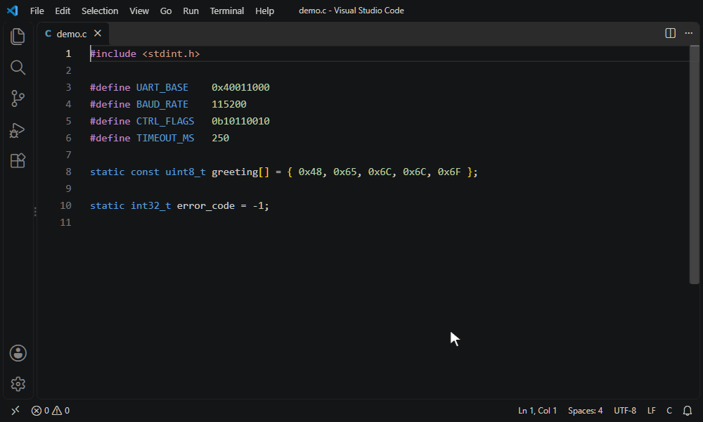
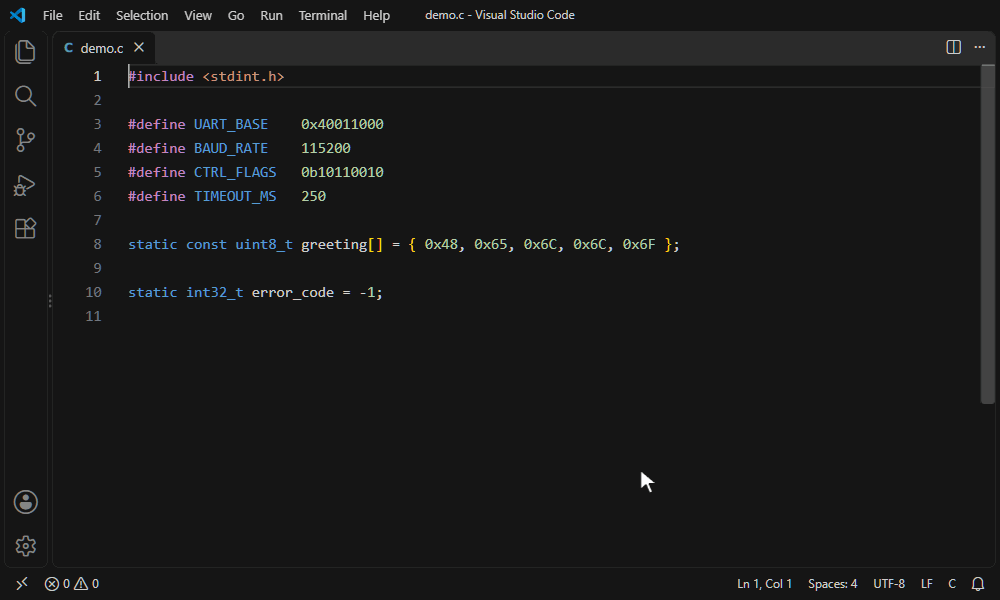
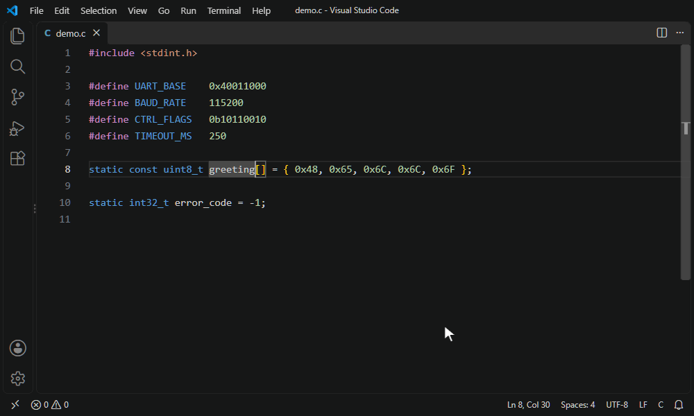
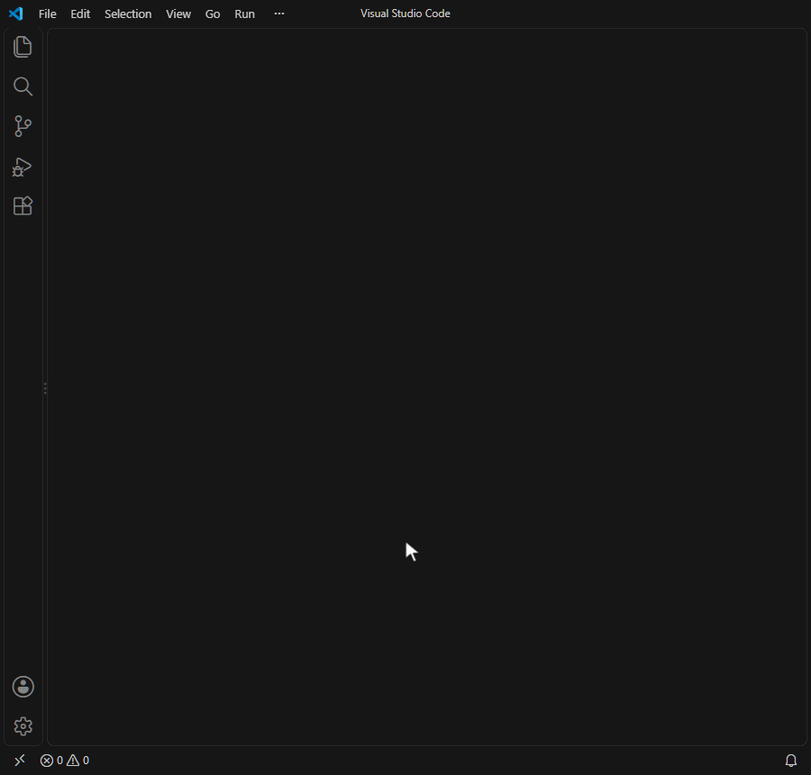

# Hex Converter

**数値を、エディタから離れずに 10 進・16 進・2 進・8 進・ASCII で確認できる VS Code 拡張機能です。**

数値にマウスを乗せる、選択してショートカットを押す、その場で書き換える。`0x40011000` や `0b10110010`、`"Hello"` のバイト列を日に何度も確認する、ファームウェア・組み込み・低レイヤーの開発向けです。

[English](https://github.com/nakayams/hex-converter/blob/main/README.md)

## 機能

### ホバーで変換

数値リテラルにマウスを乗せると、すべての表現をまとめて表示します。各行のボタンで、値を**コピー**したり、その値に**置換**したりできます。



- 10 進・16 進・2 進・8 進(2 進は 4 桁ごとに区切って表示)
- 最上位ビットが立っている場合は符号付きの値(`INT8` / `INT16` / `INT32` / `INT64`)
- 1 バイトの値は ASCII 文字か制御コード名(`LF`、`ESC` など)、`0x48656C6C6F` のような値はデコードした文字列

### 選択範囲をショートカットで変換

テキストを選択して <kbd>Ctrl</kbd>+<kbd>Alt</kbd>+<kbd>H</kbd> を押します。接頭辞のないテキストは解釈が 1 つに決まらないため、考えられる解釈をすべて表示します。



| 選択したテキスト | 表示される内容 |
|:--|:--|
| `FF` | 16 進として解釈した値と、文字列としての ASCII コード |
| `10` | 10 進・16 進・2 進それぞれとして解釈した値 |
| `-1` | 収まる最小のビット幅での 2 の補数表現 |
| `greeting` | 各文字の ASCII コード(16 進・10 進・2 進) |
| `0x48, 0x65, 0x6C, 0x6C, 0x6F` | バイト列をデコードした `"Hello"` |

### その場で置換

数値の上で <kbd>Ctrl</kbd>+<kbd>Alt</kbd>+<kbd>J</kbd> を押して形式を選ぶか、ホバーの置換ボタンをクリックすると、その場で書き換えます。複数カーソルの場合は、すべての箇所を同じ形式に変換します。



### コンバーター画面

<kbd>Ctrl</kbd>+<kbd>Alt</kbd>+<kbd>Shift</kbd>+<kbd>H</kbd> で開きます。どの欄に入力しても、他の欄が入力に合わせて更新されます。



- **数値**: DEC / HEX / BIN / OCT / ASCII の欄が連動。8 / 16 / 32 / 64 bit の切り替え、ビットのクリック反転、符号付きの値の表示
- **テキスト ⇄ ASCII コード**: 文字列と、16 進・10 進・2 進のバイト列を相互に変換
- ライト・ダークどちらの配色テーマにも追従

## 対応する書式

| 形式 | 例 |
|:--|:--|
| 10 進 | `255`、`1_000_000` |
| 16 進 | `0xFF`、`0FFh` |
| 2 進 | `0b1010_1010` |
| 8 進 | `0o17` |
| Verilog / SystemVerilog | `8'hFF`、`4'b1010`、`'d10` |
| C / C++ / Rust / JS の接尾辞 | `255U`、`0xFFUL`、`10n` |

## ショートカット

| コマンド | Windows / Linux | macOS |
|:--|:--|:--|
| 選択範囲 / カーソル位置の変換値を表示 | <kbd>Ctrl</kbd>+<kbd>Alt</kbd>+<kbd>H</kbd> | <kbd>Ctrl</kbd>+<kbd>Option</kbd>+<kbd>H</kbd> |
| 変換して置換 | <kbd>Ctrl</kbd>+<kbd>Alt</kbd>+<kbd>J</kbd> | <kbd>Ctrl</kbd>+<kbd>Option</kbd>+<kbd>J</kbd> |
| コンバーター画面を開く | <kbd>Ctrl</kbd>+<kbd>Alt</kbd>+<kbd>Shift</kbd>+<kbd>H</kbd> | <kbd>Ctrl</kbd>+<kbd>Option</kbd>+<kbd>Shift</kbd>+<kbd>H</kbd> |

3 つとも、エディタの右クリックメニューとコマンドパレット(「Hex Converter」で検索)からも実行できます。キーの割り当ては「キーボード ショートカット」で変更できます。

## 設定

| 設定 | 既定値 | 説明 |
|:--|:--|:--|
| `hexConverter.hover.enabled` | `true` | マウスホバーで変換値を表示する |
| `hexConverter.hover.decimal` | `true` | 接頭辞のない 10 進数にもホバーを表示する。すべての数字にホバーが出て邪魔な場合はオフにしてください |

どちらを無効にしても、ショートカットでのポップアップは表示されます。

## 表示言語

UI は英語と日本語に対応しており、VS Code の表示言語に従います。

## フィードバック

不具合の報告や要望は、[GitHub の issue](https://github.com/nakayams/hex-converter/issues) からお願いします。

## ライセンス

[MIT](https://github.com/nakayams/hex-converter/blob/main/LICENSE)

## 開発

```
npm install
npm run compile
```

VS Code でこのフォルダを開き、`Ctrl+F5` で拡張機能開発ホストが起動します。
